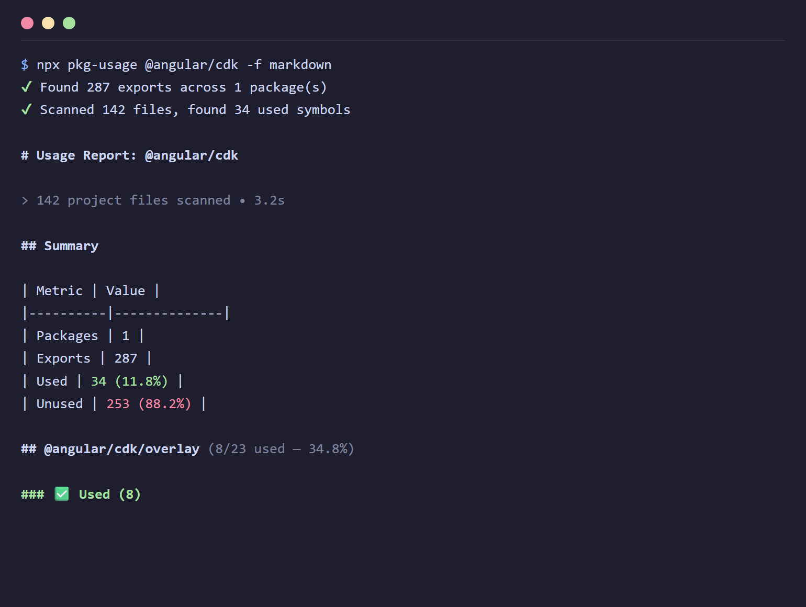
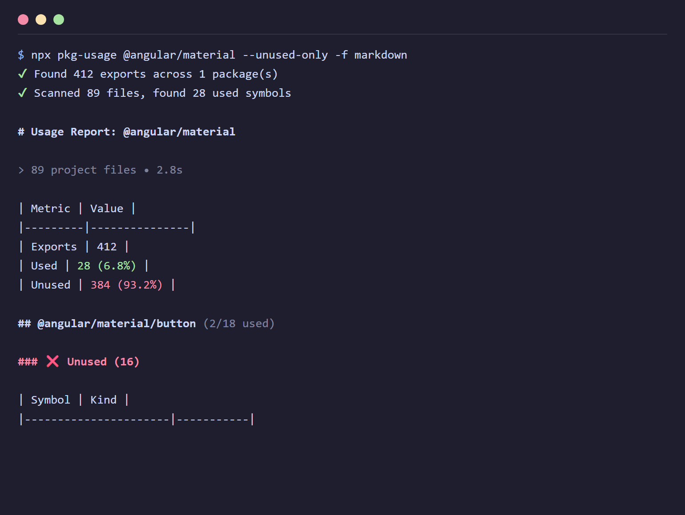
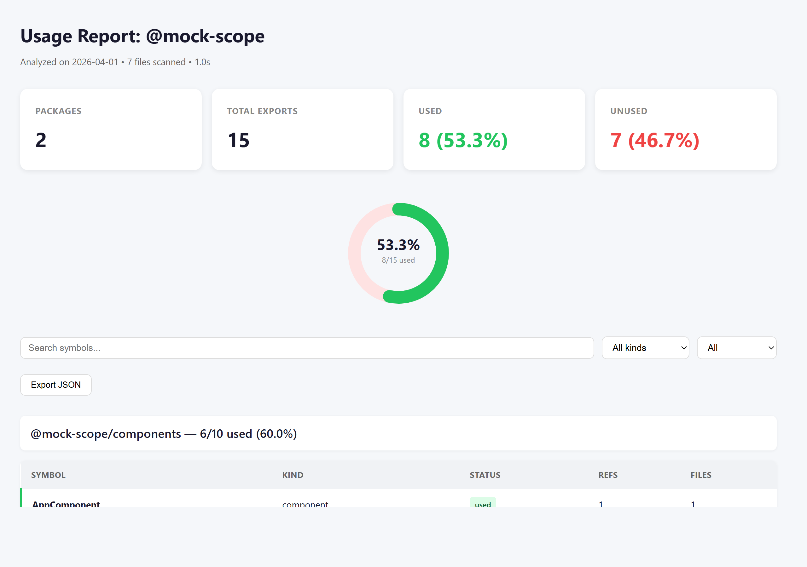

# pkg-usage

Analyze which public exports of an npm package or scope are actually used in your TypeScript project.

Works with any npm package that ships type definitions (`.d.ts`). Discovers all exported symbols, scans your source for imports and usages, and reports what's used and what's not.

## Install

```bash
npm install -g pkg-usage
# or use directly
npx pkg-usage lodash-es
```

## Usage

```bash
# Analyze a package
npx pkg-usage lodash-es

# Analyze an entire scope
npx pkg-usage @nestjs

# Analyze a specific entry point
npx pkg-usage rxjs/operators

# Markdown report
npx pkg-usage zod -f markdown -o report.md

# Interactive HTML report
npx pkg-usage rxjs -f html

# Only show unused exports
npx pkg-usage @tanstack/react-query -f markdown --unused-only

# Deep analysis with exact reference counts
npx pkg-usage rxjs --deep

# Custom tsconfig
npx pkg-usage @trpc/server -p ./apps/api/tsconfig.json
```

## Output formats

### Markdown



### Unused audit



### Interactive HTML report

Single-file HTML with donut chart, filters, search, expandable details, and JSON export.



## Options

```
pkg-usage <target> [options]

Arguments:
  target               Package, scope, or entry point

Options:
  -p, --project        Path to tsconfig.json          [default: ./tsconfig.json]
  -f, --format         Output format: json, markdown, html       [default: json]
  -o, --output         Output file (default: stdout, html defaults to report.html)
      --include-types  Count type-only imports as "used"    [default: false]
      --include-tests  Include .spec.ts/.test.ts files      [default: false]
      --unused-only    Show only unused symbols              [default: false]
      --used-only      Show only used symbols                [default: false]
      --min-refs       Filter: symbols with at least n references
      --sort           Sort by: name, kind, refs             [default: name]
      --summary        Summary only, no per-symbol detail    [default: false]
      --deep           Exact reference counting (slower)     [default: false]
      --exclude        Exclude files matching pattern (repeatable)
      --verbose        Detailed logs                         [default: false]
      --no-color       Disable terminal colors               [default: false]
```

## Programmatic API

```typescript
import { analyze } from 'pkg-usage';
import { toJson, toMarkdown, toHtml } from 'pkg-usage/reporters';

const result = await analyze({
  target: 'rxjs',
  projectRoot: process.cwd(),
});

console.log(toMarkdown(result));
```

## What it detects

**Export discovery** (any npm package with `.d.ts`):
- `package.json` `exports` field (conditional exports with `types` condition)
- Fallback to `types`/`typings` field, then `index.d.ts`
- Recursive `export *` resolution in `.d.ts` files
- Classes, functions, constants, interfaces, type aliases, enums

**Usage scanning:**
- Named imports (`import { Foo } from '@pkg'`)
- Type-only imports (`import type { Foo } from '@pkg'`)
- Re-exports (`export { Foo } from '@pkg'`)
- Local barrel tracking (imports through project barrel files)
- Namespace imports with `--deep` (`import * as X from '@pkg'` then `X.Foo`)
- SCSS `@use`/`@import` from packages

**Angular extras** (detected automatically when applicable):
- Symbol classification (`Component`, `Directive`, `Pipe`, `Service`, `NgModule`, `InjectionToken`)
- Standalone component decorators (`@Component({ imports: [...] })`)
- `@NgModule` decorator arrays (`imports`, `providers`)
- Template usages (component selectors, directive attributes, pipes)
- Constructor injection with `--deep`

## Requirements

- The analyzed package must be installed in `node_modules` (the tool reads its `.d.ts` files)
- Your project needs a `tsconfig.json`

## License

MIT
